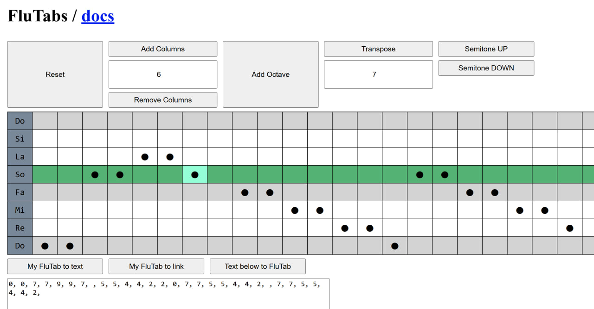

# FluTabs - Flute tabulatures

#### Video demo: https://youtu.be/SIT48UL8kl4 3:00

#### Video demo long: https://youtu.be/AU9LGiVEpHA 5:40

#### Try it out: https://rioran.github.io/flutabs/

#### Preview:

#### Disclaimer

I am a hobby recorder player. I have several instruments and I play regularly on tenor, alto, soprano and sopranino recorders. I am self-taught and may occasionally lack musical theory. Among other aerophones I also have little to some experience with metal flute, saxophone, ireland whistle, armenian duduk, chineese ocarina and melodica.

FluTabs ideas are in its core questionable. I am aware of criticism of the "yet another note system" idea. I did FluTabs anyway because it is fun for me and brings nonzero value to the table.

During my work I didn't use any AI for code composition. Though I consulted frequently [Microsoft Copilot](https://copilot.microsoft.com/) for links to the JavaScript or CSS documentation in order to grasp syntax since my primary programming langauge is Python. I also asked [CS50 AI](https://cs50.ai/chat) a couple of questions on how to use cs50 submission tools.

#### Description:

This is Harvards cs50 with recorder (aerophones in general) tabulatures front end web application for quick composing, musical transposing and sharing via serialized format. Project revolves around JavaScript usage and less around CSS.

Based on my [hobby article](https://vas3k.club/idea/27765/) idea in Russian language.

#### Key ideas:

I made FluTabs in order to help me withstand a challenge of making a short video of me playing new melody every day. Sometimes I really liked the melody but couldn't play in the original tuning and worked hard to transpose myself. Or other times there were no notes for the recorder and I had to extract the melody from piano notes or YouTube piano videos with a lot of noise from polyphonia.

So here comes FluTabs to land me a hand. How:

- Classical notes could be simplified in order to keep the essence of the melody.
  - Marks for sharp notes, tempo, techniques, repetitions, etc. are excluded. Exclusion of sharp notes reasoning: oftenly to get a flat note you add finger positions to the same natural note. 
  - 5 drawn lines per almost octave are replaced with 3 visually distinguishable to highlight Do and Fa notes - those are essential for most popular tunings of recorders.
  - Notes are represented by symbols: ⬤ for a natural note and ◀ for flat ones. It helps since very often natural notes are much easier to play.
- FluTabs are fast and easy to compose in mere clicks. So it is not a struggle anymore to keep track of which piano notes from a sheet of video do I need to remember, all the noise of other notes is gone.
- FluTabs are, by no means, replacement for notes - just a simplification, fully compatible with classic notes. This way they are not an alternative to those, but a supportive mechanism, especially on the earliest stages of learning curve. And are easily convertable between notes and vice versa by using other grid.
- FluTabs - as notes also are - depend on musicians knowledge on how to grapple a specific note, thus making FluTabs applicable to a wide range of aerophones.

### Features

- Visually construct a melody in a recorder friendly format with common notes notation simplified.
  - Click grid cells to either assign a note ⬤, change it to a flat note ◀ or to clear whole column
  - Auto columns prolongation when user changes the last or second to last column.
- Share your melody with others by serializing it into semitones number format with a single push of the "Get shareble version" button.
- Load melodies from others (or your own) by pasting semitones string into the input field and pressing "Visualize" button.
- Share your melody as a link. FluTabs can read parameter "melody" from the href.
- When melody is loaded - it trims automatically so empty edges are dropped out.
- Edit the melody both by clicking or by changing the semitones string in the input field.
- When last 2 columns of melody change - table smoothly scrolls to the added 2 new columns sustaining editing workflow.
- Traspose melodies by a number of semitones or push them step by step via +1 or -1 button.
- When transposing - FluTabs will delete unused octaves from the top of the grid.
- Left menu with note names sticks to the screen even if you scroll far horizontally.
- See whole row highlighted when you hover with mouse for easier note identification.
- Use "Reset" button to start anew.
- Add octave above the current one.
- Add or delete a number of columns from the end of the grid.
- Several melodies come included - with a single click you can try some popular tunes:
  - Deep Purple - Smoke on the Water. Short, simple, ideal to test FluTabs features.
  - Twinkle Twinkle little star. Almost an octave wide, simple.
  - Kansas City - Carry on. More gaps between notes.
  - Undertale theme - Megalovania. Dynamic, single octave, flat notes unaviodable.
  - Mozart - Symphony No. 40. Hard 2 octave piece.
  - and others.

#### Key bindings

- `ESC` to reset the page without parameters.
- `q` to add an octave above.
- `w` to transpose semitone up, `s` to transpose down.
- `a` to remove columns from right, `d` to add.
- `z` to capture FluTab as text.
- `x` to capture FluTab as link with parameter.
- `c` to build FluTab from input text.

#### Important Files

- [index.html](index.html) - the only page, entry point for the user.
- [README.md](README.md) - this documentation.
- [main.js](static/js/main.js) - main JavaScript file with HTML content manipulation.
- [constants.js](static/js/main.js) - key constants for other JavaScript files.
- [melody_math](static/js/melody_math.js) - support functions to process melodies and notes.

#### Semitone string specification

- Semitone string must be composed of numbers, representing distance of current note from some Do at the bottom.
- Negative numbers are not allowed - in some cases FluTabs will rise values by octaves for all notes to be at least of zero value.
- Some values might be empty - this represents a silent pause.
- All values must be separated with ", " - comma and a space.

#### Melody processing mechanics

- Under the hood of FluTabs interface melodies are organized into lists composed of integers and null values.
- To collect a melody list a number of operations are performed in order to compute melody semitones values out of table rows numbers.
  - First a reverse row number is computed since semitone pitch visually grows in opposite direction to the table row where it is placed visually. Thus row with index 4 from a table with 13 rows in total becomes a reverse row as follows: 13 - 1 - 4 = 8.
  - Next reverse row is multiplied by 2 - since I found it easier to achieve specific note semitone value by subtracting from a duplicate index dependant value.
  - This subtraction operations utilize fact that there are only 2 pairs of notes in the octave which distance is a single semitone instead of two.
- Semitone value to row index also has several operations included:
  - I calculate the octave index by integer division of the semitone value with 12.
  - Each octave takes 7 rows - so I multiply octave index by 7.
  - Next I calculate the remainder after dividing semitone value by 12.
  - Remainder logical processing allows me to define how grid index must be finalized and whether it will result in a natural note ⬤ or a flat one ◀.

#### Next possible features:

- more controls for track (like insert or delete columns anywhere)
- allow user comments
- make back end to keep track of saved melodies
